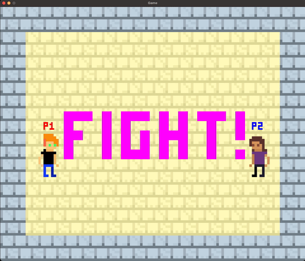

# C++ Game)

> Note:
    This is a *work in progress* and I haven't yet finished watching the tutorial.

> Note:
    This project is developed on a Mac, though most of the source code should work on
    other platforms.

> **KNOWN BUGS:**
    - Segmentation fault when launching the executable by double clicking (instead of using the command line).
    - Segmentation faults when creating too many projectiles at once. Probably due to a memory leak in the *Manager* object.

This small project follows the footsteps of [Let's make games' "How to make a
game"
tutorial](https://www.youtube.com/watch?v=QQzAHcojEKg&list=PLhfAbcv9cehhkG7ZQK0nfIGJC_C-wSLrx),
as a means of learning a little bit of C++. The idea is **not**
to stick to the tutorial, but to give my own touches along the
way. For a repository exactly as the tutorial's, see [the tutorial's
repository](https://github.com/carlbirch/BirchEngine).

To set up SDL2 and SDL2_image on MacOS, I've used [the following tutorial](https://www.youtube.com/watch?v=Dyz9O7s7B8w&t=1002s&ab_channel=IndependentPixels). This helped me define the make file, as well as the *include* and *lib* folders (not included in this repository, but referenced in the make file).

The game is 2D and has an "8-bit" style. The assets in this
repository are original and were made in
[Aseprite](https://www.aseprite.org/).

I try to extensively document (comment) what I learn along the
way in this repository.

### Current state of development
> You can now toggle whether the camera should follow the player or not with the
> P and L keys. You can also exit the game by clicking ESC.

### Libraries/Requirements

The [SDL2 library](https://www.libsdl.org/) is used, as stated in
the tutorial. The tutorial also uses SDL2_image. At the start of development, I could
not download it, so I have circumvented its use by using bitmap (.bmp) images, which
are supported by the SDL2 library. After updating my OS, I have managed to install
SDL2_image, so it might be used in the future.

The Makefile used for compilation in VSCode is provided.